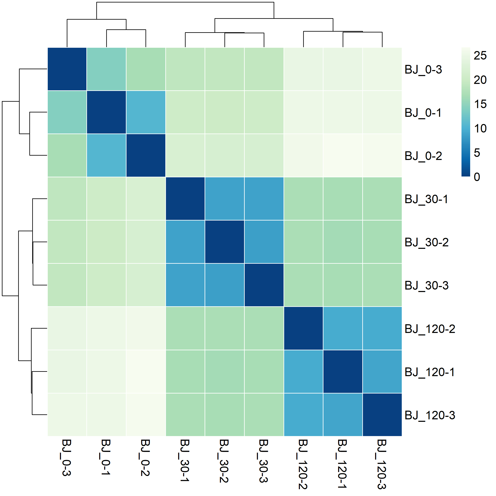

# Transcriptome analysis

**Prerequisites:**  
[cutadapt 1.18](https://cutadapt.readthedocs.io/en/stable/index.html)  
[STAR-2.6.1d](https://github.com/alexdobin/STAR)  
[gffread utility](http://ccb.jhu.edu/software/stringtie/gff.shtml)  
Transcriptome samples were sequenced in paired-end 150 nt mode on Illumina sequencer.
Raw sequencing files are available from [GEO]().

### Preparing genome annotation and index files
Human genomic sequences and annotation files (GRCh38.p12) were downloaded from the [NCBI repository](http://ftp.ncbi.nih.gov/genomes/H_sapiens/).

| files             | MD5 check sum (unzipped)         | Description                                               |
| ----------------- |:--------------------------------:| ----------------------------------------------------------|
| GRCh38.p12.fa     | a4cac7d7ac4dd31ac68b384b10cf444d | RNA in fasta format, coding + noncoding                   |
| GRCh38.p12.fna    | 860290186a4ee3e95cd48dc528a45363 | Genome sequence, chromosomes and extrachromosomal contigs |
| GRCh38.p12.gbk    | 3c35b07e638485984479d50dd5cfebca | RNA in gene bank format, coding + noncoding               |
| GRCh38.p12.gff    | 56394751c00a5bdfb74152a7ed146855 | Genome annotation                                         | 

### Customizing genome annotation  
<details><summary><b>Edit chromosome names in GRCh38.p12.fna genome file.</b></summary>
STAR manual recommends not having spaces in contig names.   
     
```perl
#!/usr/bin/perl
# write output to GRCh38.p12.headers.fna
open (INPUT, '<GRCh38.p12.fna') or die "Can't open file";

while ($line = <INPUT>)  {
     @line = split('\s+', $line);
     if(substr($line[0],0,1) eq '>') {
           print $line[0]."\n";
           while ($line = <INPUT>) {
                  if (substr($line,0,1) ne '>') { print $line;   }
                  else {last;}                
           }
           redo; 
     } 
}
close(INPUT);
```
</details>

<details><summary><b>Drop extra-chromosomal contigs.</b></summary>
     
```perl
#!/usr/bin/perl
# write output to GRCh38.p12.chromosomes.fna

my %chromosomes =('NC_000001.11',0,
                  'NC_000002.12',0,
                  'NC_000003.12',0,
                  'NC_000004.12',0,
                  'NC_000005.10',0,
                  'NC_000006.12',0,
                  'NC_000007.14',0,
                  'NC_000008.11',0,
                  'NC_000009.12',0,
                  'NC_000010.11',0,
                  'NC_000011.10',0,
                  'NC_000012.12',0,
                  'NC_000013.11',0,
                  'NC_000014.9',0,
                  'NC_000015.10',0,
                  'NC_000016.10',0,
                  'NC_000017.11',0,
                  'NC_000018.10',0,
                  'NC_000019.10',0,
                  'NC_000020.11',0,
                  'NC_000021.9',0,
                  'NC_000022.11',0,
                  'NC_000023.11',0,
                  'NC_000024.10',0 );

open (INPUT, '<GRCh38.p12.headers.fna') or die "Can't open file";


while ($line = <INPUT>)  {
     @line = split('\s+', $line);
     if(substr($line[0],0,1) eq '>' && exists($chromosomes{substr($line[0],1)})) {
           print $line[0]."\n";
           while ($line = <INPUT>) {
                  if (substr($line,0,1) ne '>') { print $line;   }
                  else {last;}                
           }
           redo; 
     }
    
}
close(INPUT);
```
</details>

<details><summary><b>Add PhiX genome, mitochondrial genome and rRNA precursors</b></summary>
     
 ```bash
dos2unix GRCh38.p12.chromosomes.fna # if the file was created on Windows machine
dos2unix Human_r_mt_tRNA.fa         # if the file was created on Windows machine
cat GRCh38.p12.chromosomes.fna Human_r_mt_PhiX.fa >GRCh38.p12.custom.fna
```    
</details>


<details><summary><b>Drop annotation of extrachromosomal contigs</b></summary>

```perl
#!/usr/bin/perl
# write output in GRCh38.p12.chromosomes.gff

my %chromosomes =('NC_000001.11',0,
                  'NC_000002.12',0,
                  'NC_000003.12',0,
                  'NC_000004.12',0,
                  'NC_000005.10',0,
                  'NC_000006.12',0,
                  'NC_000007.14',0,
                  'NC_000008.11',0,
                  'NC_000009.12',0,
                  'NC_000010.11',0,
                  'NC_000011.10',0,
                  'NC_000012.12',0,
                  'NC_000013.11',0,
                  'NC_000014.9',0,
                  'NC_000015.10',0,
                  'NC_000016.10',0,
                  'NC_000017.11',0,
                  'NC_000018.10',0,
                  'NC_000019.10',0,
                  'NC_000020.11',0,
                  'NC_000021.9',0,
                  'NC_000022.11',0,
                  'NC_000023.11',0,
                  'NC_000024.10',0 );

open (INPUT, '<', '../NCBI_GRCh38.p12_originals/GRCh38.p12.gff') or die "Can't open file";

for (my $i=0; $i < 6; $i++){$line = <INPUT>; print $line;}
while($line = <INPUT>)
  {
     if(substr($line,0,3) eq '###') {print '###'; last;}
     else {
            @line = split /\s/,$line;
            if(exists($chromosomes{$line[1]}))
               {
                 print $line;
                 $line = <INPUT>;
                 do {print $line; $line = <INPUT>;} until(substr($line,0,2) eq '##');
                 redo;
               }
             else {do {$line = <INPUT>;} until(substr($line,0,2) eq '##'); redo;}
          }
  }
close(INPUT);
```

</details>


<details><summary><b>Drop 'Gnomon' (predicted) records from gff file and only keep 'RefSeq' (manually curated).</b></summary>
  
```perl
#!/usr/bin/perl
# write output in GRCh38.p12.RefSeq.gff

open (INPUT, "<GRCh38.p12.chromosomes.gff"); 
for($i=0; $i < 8; $i++) {$line = <INPUT>; print $line;}
while ($line = <INPUT>)  {
     @fields = split /\t/, $line;
     if($fields[1] ne 'Gnomon' && $fields[1] ne 'Curated Genomic')  {  print $line;  }
}
close(INPUT); 
```
</details> 

<details><summary><b>Drop non-coding features from annotation.</b></summary>

Remove non-coding RNA genes, leave only coding genes with their mRNA, transcript, exon, and CDS children. Fix the gff annotation from previous script by matching gene coordinates with the childern coordinates (occured due to removal of Gnomon features).  
```R
library(data.table)
library(magrittr)
library(rstudioapi)
library(stringr)
setwd(dirname(getActiveDocumentContext()$path))

#------------------------------------------ Define some useful functions -----------------------------------------------------------------------
linkage <- function(gff) { # creates a 2-column table with children->parent linkages. Takes original gff annotation as its argument.
  output <- apply(gff[,9], 1, function(x) {
    id <- substr(x, 4, regexpr(';', x) - 1)
    if(regexpr('Parent=', x)[[1]] > 0) { parent <- substr(x, regexpr('Parent=', x) + 7, gregexpr(';', x)[[1]][2] -1); return(c(id, parent))}
    else {return(c(id, "Primary"))}
  }) %>% t() %>% as.data.frame(., stringsAsFactors = F) %>% setNames(., c("ID", "Parent1"))
  return(output)
}

chain <- function(x) { # reconstitutes a full chain of parents for every child record. Takes the output of the linkage function as its argument.
  temp <- x[match(x[, ncol(x)], x$ID), "Parent1"]
  temp[is.na(temp)] <- "Primary"
  temp <- as.data.frame(temp, stringsAsFactors = F) %>% setNames(., paste0("Parent", ncol(x)))
  print(length(unique(temp[,1])))
  if(length(unique(temp[,1])) == 1) {return(x)}
  else{ return(chain(cbind(x, temp))) }
}

remove.features <- function(gff, type, parents){ # removes unwanted feature types from the gff file together with their children and parents
              id <- gff[unlist(gff[,3]) %in% type, 9] %>% apply(., 1, function(x) {substr(x, 4, regexpr(';', x) - 1)})
              #parents <- chain(linkage(gff))
              primary_id <- apply(parents[match(id, parents$ID), ], 1, function(x) {
                record <- x[x != "Primary"] 
                record <- record[length(record)]
                return(record)
              }) %>% unname() %>% unique()
              
              discard_lines <- sapply(parents, function(x) {  x %in% primary_id    }) %>% apply(., 1, function(x) { any(x) }) 
              output <- gff[!discard_lines, ]
              return(output)
}

extract.id <- function(gff, type, level = "Primary", parents){ # simplified version of remove.features() that only reports top-level (Primary) or their own local IDs for given feature types
              id <- gff[unlist(gff[,3]) %in% type, 9] %>% apply(., 1, function(x) {substr(x, 4, regexpr(';', x) - 1)})
              if(level != "Primary") {return(id)}
              else { #parents <- chain(linkage(gff))
                     primary_id <- apply(parents[match(id, parents$ID), ], 1, function(x) {
                        record <- x[x != "Primary"] 
                        record <- record[length(record)]
                        return(record)
                      }) %>% unname() %>% unique()
              return(primary_id)
              }
}

#----------------------------------------------------------------------------------------------------------------------------------------
# Load GFF annotation file
gff    <- fread(file="GRCh38.p12.Refseq.gff", skip = 8, stringsAsFactors = F, header = F, fill = T, na.strings = c("", "NA"), sep="\t") %>% na.omit() #deals with unwanted #comment lines in the gff
gff$ID <- apply(gff[,9], 1, function(x) { id <- substr(x, 4, regexpr(';', x) - 1) })

# create a table of parents-children relations
parents.table <- chain(linkage(gff))

# Create a list of top parents with all childrens listed (Caution: takes ~1 hour) # Save the R object for future use to avoid re-calculations.
parents.tree.names <- unique(parents.table[parents.table$Parent1 == 'Primary', 'ID'])
parents.tree <- lapply(parents.tree.names, function(parent) {
                children <- lapply(parents.table, function(x) { 
                            row <- which(!is.na(match(x, parent)))
                            children <- parents.table[row, ] %>% unname() %>% unlist() %>% .[!. %in% c(parent, 'Primary', NA)] 
                }) %>% unlist() %>% unname() %>% unique()
  
}) %>% setNames(parents.tree.names)


#saveRDS(parents.tree, file = "parents_tree.rds")


# fix gene boundaries to be the same as the span of children features. The discrepancy occured when I removed Gnomon records. Some gene names were shared between BestRefseq and Gnomon as 'BestRefSeq%2CGnomon'. Their boundaries are wider than corresponding BestRefSeq childs.
setindex(gff, ID)
for(name in names(parents.tree)) {
    slice <- gff[name, on = 'ID']

    if(nrow(slice) == 1){
      gene_start <- slice[, V4] 
      gene_end   <- slice[, V5] 

      if(length(parents.tree[[name]]) != 0)   {
            children_start <- gff[parents.tree[[name]], V4, on = 'ID'] %>% min()
            children_end   <- gff[parents.tree[[name]], V5, on = 'ID'] %>% max()
            if(children_start > gene_start) { gene_start = children_start }
            if(children_end   < gene_end  ) { gene_end   = children_end   }

      } 
      gff[name, on = 'ID', V4 := gene_start]
      gff[name, on = 'ID', V5 := gene_end]
    }
} 
        # con <- file("GRCh38.p12.Refseq.gff", "r")
        # header <- readLines(con, n = 8)
        # write.table(header, file = "GRCh38.p12.RefseqSTAR.fixed.gff", col.names = F, row.names = F, quote = F)
        # write.table(gff[,1:9], file = "GRCh38.p12.RefseqSTAR.fixed.gff", sep = "\t", row.names = F, col.names = F, quote = F, append = T)
        # close(con); rm(con)

# Remove non-coding features
# check all present top level features: 
# table(gff[,3])
# Tips: NCBI RefSeq. Difference between 'mRNA' and 'transcript' features is the former have CDS and the latter do not.
# Gene --> mRNA --> CDS and exons.
# Gene --> transcript --> exons
# Therefore, do not remove 'transcripts' otherwise you remove their gene parents.

gff2 <- remove.features(gff, c('antisense_RNA','biological_region','cDNA_match','centromere','D_loop', 'guide_RNA','lnc_RNA','match','miRNA','primary_transcript','pseudogene','region','RNase_MRP_RNA','RNase_P_RNA','rRNA','sequence_feature','scRNA','snoRNA','snRNA','telomerase_RNA','tRNA','vault_RNA','Y_RNA'), parents.table)
        con <- file("GRCh38.p12.Refseq.gff", "r")
        header <- readLines(con, n = 8)
        write.table(header, file = "GRCh38.p12.Refseq.codingSTAR.gff", col.names = F, row.names = F, quote = F)
        write.table(gff2[,1:9], file = "GRCh38.p12.Refseq.codingSTAR.gff", sep = "\t", row.names = F, col.names = F, quote = F, append = T)
        close(con); rm(con)


```
</details>

<details><summary><b>Convert annotation from GFF3 to GTF format.</b></summary>  
     
```bash
gffread GRCh38.p12.Refseq.coding.gff -T -o GRCh38.p12.Refseq.coding.gtf
# -T          - convert gff/gtf
```
</details>

### Sequencing reads filtering and mapping   
<details><summary><b>Illumina adapters trimming.</b></summary>

```bash
cutadapt -j 20 -m 75 -O 5 -a AGATCGGAAGAGCACACGTCTGAACTCCAGTCAC -A AGATCGGAAGAGCGTCGTGTAGGGAAAGAGTGTAGATCTCGGTGGTCGCCGTATCATT -o out.1.fastq -p out.2.fastq read.1.fq.gz read.2.fq.gz
# -j      - number of threads
# -m      - discard read pair if any of the mates if shorter than 75 nucleotides after adapter trimming
# -O      - minimal length of the adapter to be considered for trimming
```
</details>

<details><summary><b>Build human genomic index for STAR.</b></summary>
     
```bash
STAR --runThreadN 40 --runMode genomeGenerate --genomeDir ./Human_index/ --genomeFastaFiles ./GRCh38.p12.custom.fna --sjdbGTFfile ./GRCh38.p12.Refseq.coding.gtf --sjdbGTFtagExonParentTranscript Parent --sjdbOverhang 149
```
</details>

<details><summary><b>Read mappping and counting with STAR.</b></summary>

```bash
STAR --genomeLoad LoadAndExit --genomeDir ../STAR-2.6.1d/Human_index/ 	# load genome once in the shared memory
STAR --runThreadN 40 --outSAMtype BAM Unsorted --outSAMmultNmax 1 --genomeLoad LoadAndKeep --genomeDir ../STAR-2.6.1d/Human_index/ --readFilesIn out.1.fastq out.2.fastq --outFileNamePrefix ./OUT_folder 
STAR --genomeLoad Remove 	# remove loaded genome from shared memory
# ipcs - check shared memory consumption
# ipcrm - remove object from shared memory
```
</details>

### Sample clustering, quality checks  
Code is available in **DataAnalysis.R** script  
<details><summary><b>Matrix scatterplot</b></summary> 
     
</details>

<details><summary><b>PCA plot of individual samples</b></summary> 
Combined PCA
     
<br>
     
Separate PCA plots for each cell line  

 
     
</details>

<details><summary><b>Heatmap clustering of individual samples</b></summary>
Combined PCA  
   
<br>    

Separate heatmaps for each cell line  

 
     
</details>

### Differential gene expression analysis
<details><summary><b>Differential gene expression</b></summary>
Code is available in **DataAnalysis.R** script  
Results can be downloaded [here](https://1drv.ms/f/s!AoCZgWcUJRIslh_glE5N__y64TKK).  
</details>
